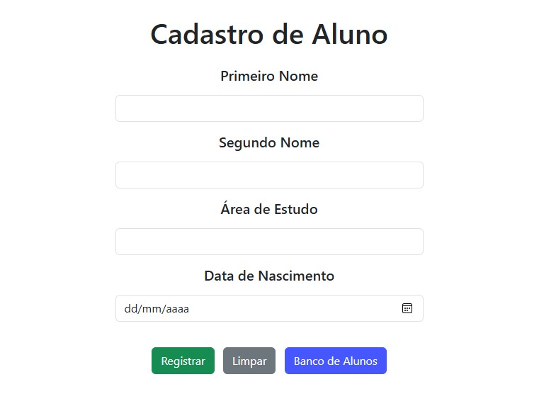

<h1 align="center"> Tela de Cadastro de Alunos </h1>

Projeto feito durante o curso Full Stack Javascript pela One Bit Code.

  <a href="#-tecnologias">Tecnologias</a>&nbsp;&nbsp;&nbsp;|&nbsp;&nbsp;&nbsp;
  <a href="#-projeto">Projeto</a>&nbsp;&nbsp;&nbsp;

 

  

## 🚀 Tecnologias

Esse projeto foi desenvolvido com as seguintes tecnologias:

- HTML
- JavaScript
- Bootstrap
- Git e Github

## 💻 Projeto

O projeto foi desenvolvido com o objetivo de permitir o cadastro de alunos e posterior visualização do banco de alunos.

### Funcionamento

Na tela de cadastro, entra-se com os dados dos alunos e os registra. Após, os dados digitados são armazenados no navegador e apagados da tela para permitir um novo cadastro. A qualquer momento, é possível visualizar o banco de alunos registrados clicando-se no botão "Banco de Alunos" que irá redirecionar para outra página e listar os dados na tela.

### Melhorias

Em comparação ao projeto original desenvolvimento durante o curso, foi adicionada a seguinte melhoria:

- Armazenamento dos dados no navegador.